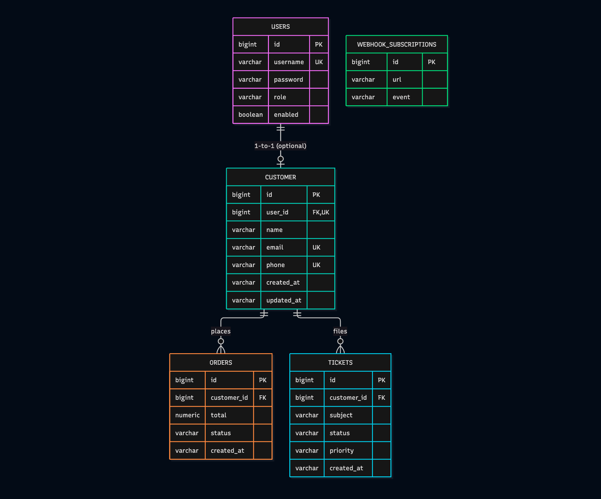
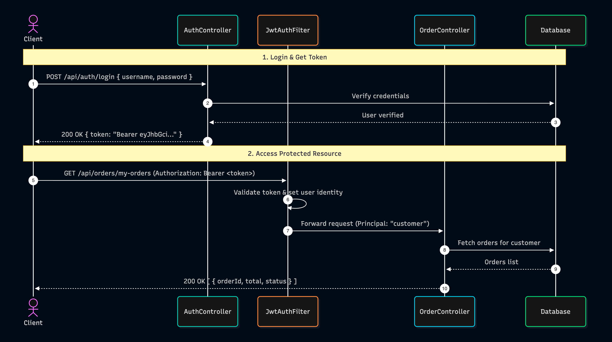

# Customer Care Portal API (ccp_api)

Customer Care Portal Backend built with **Spring Boot 4**, **Spring Security (JWT)**, **Spring Data JPA**, **STOMP WebSockets**, and **Outbound Webhooks with HMAC Verification**.

---

## Tech Stack & Prerequisites

- **Java**: 17 or higher
- **Framework**: Spring Boot 4.1.x
- **Security**: Spring Security & JJWT (0.12.x)
- **Database**: H2 (File-based: `./data/carepdb`)
- **Persistence**: Spring Data JPA / Hibernate ORM
- **Messaging**: Spring WebSocket & STOMP / SockJS
- **HTTP Client**: Spring 6+ `RestClient`
- **Build Tool**: Maven Wrapper (`./mvnw`)

---

## How to Run the Project

1. **Clone the repository**:
   ```bash
   git clone <repo-url>
   cd ccp_api
   ```

2. **Run using Maven Wrapper**:
   ```bash
   ./mvnw spring-boot:run
   ```

3. The application will start on port `8080`:
   ```text
   Tomcat started on port 8080 (http) with context path '/'
   ```

---

## Default Seed Accounts & H2 Console

When the application starts, [`DataInitializer`](file:///src/main/java/com/mohammadshoubash/ccp_api/config/DataInitializer.java) creates initial accounts if they don't exist:

| Username | Password | Role | Associated Customer Profile |
| :--- | :--- | :--- | :--- |
| `admin` | `admin123` | `ROLE_ADMIN` | None (System Administrator) |
| `customer` | `customer123` | `ROLE_CUSTOMER` | `Demo Customer` (`customer@example.com`) |

### H2 Database Console
- **URL**: [http://localhost:8080/h2-console](http://localhost:8080/h2-console)
- **JDBC URL**: `jdbc:h2:file:./data/carepdb`
- **Username**: `sa`
- **Password**: *(leave blank)*

---

## Entity-Relationship (ER) Diagram


---

## Authentication & JWT Guide

All secured endpoints expect the JWT token in the `Authorization` HTTP header:
```http
Authorization: Bearer <YOUR_JWT_TOKEN>
```

### Authentication Flow


### Roles & Permissions

| Endpoint Path Pattern | Allowed Roles | Description |
| :--- | :--- | :--- |
| `/api/auth/**` | `PermitAll` | Public sign up and log in |
| `/h2-console/**` | `PermitAll` | Database management console |
| `/webhooks/**` | `PermitAll` | Outbound subscription & incoming receiver |
| `/ws/**`, `/ws-test.html` | `PermitAll` | WebSocket handshake and test UI |
| `/api/admin/**` | `ADMIN` | User administration & role changes |
| `/api/customers/**` | `ADMIN` | Customer profile management |
| `/api/orders/**` | `ADMIN` or `CUSTOMER` | Order operations (view own, create, search) |
| `/api/tickets/**` | `ADMIN` or `CUSTOMER` | Ticket operations (view own, create, update) |

---

## API Endpoints Reference

### 1. Authentication Endpoints

#### Register a new Customer account
- **Method**: `POST /api/auth/register`
- **Access**: Public
- **Request Body**:
  ```json
  {
    "username": "johndoe",
    "password": "password123"
  }
  ```
- **Response** (`201 Created`):
  ```json
  {
    "id": 3,
    "username": "johndoe",
    "role": "CUSTOMER",
    "enabled": true
  }
  ```

#### Login & Obtain JWT Token
- **Method**: `POST /api/auth/login`
- **Access**: Public
- **Request Body**:
  ```json
  {
    "username": "customer",
    "password": "customer123"
  }
  ```
- **Response** (`200 OK`):
  ```json
  {
    "token": "eyJhbGciOiJIUzI1NiJ9...",
    "type": "Bearer",
    "expiresInMs": 3600000
  }
  ```

---

### 2. Customer Endpoints

| Method | Endpoint | Access | Description |
| :--- | :--- | :--- | :--- |
| `GET` | `/api/customers` | `ADMIN` | List all customer profiles |
| `GET` | `/api/customers/{id}` | `ADMIN` | Get customer profile by ID |
| `POST` | `/api/customers` | `ADMIN` | Create a new customer profile |
| `PUT` | `/api/customers/{id}` | `ADMIN` | Update customer profile |
| `DELETE` | `/api/customers/{id}` | `ADMIN` | Delete customer profile |
| `GET` | `/api/customers/{id}/orders` | `ADMIN` | List all orders belonging to a customer |
| `GET` | `/api/customers/{id}/tickets` | `ADMIN` | List all tickets belonging to a customer |

---

### 3. Order Endpoints

#### Get My Orders (Logged-in Customer)
- **Method**: `GET /api/orders/my-orders`
- **Access**: `CUSTOMER` or `ADMIN`
- **Headers**: `Authorization: Bearer <TOKEN>`
- **Response** (`200 OK`):
  ```json
  [
    {
      "id": 1,
      "customer_id": 1,
      "total": 149.99,
      "status": "PENDING"
    }
  ]
  ```

#### Get Order by ID
- **Method**: `GET /api/orders/{id}`
- **Access**: `ADMIN` or the **Owner** of the order
- **Response** (`200 OK`):
  ```json
  {
    "id": 1,
    "customer_id": 1,
    "total": 149.99,
    "status": "PENDING"
  }
  ```

#### Create Order
- **Method**: `POST /api/orders`
- **Access**: `ADMIN` or `CUSTOMER`
- **Request Body**:
  ```json
  {
    "customer_id": 1,
    "status": "PENDING",
    "total": 299.50
  }
  ```

#### Update Order Status (Triggers Webhook!)
- **Method**: `PATCH /api/orders/{id}/status`
- **Access**: `ADMIN` or the **Owner** of the order
- **Request Body**: `"SHIPPED"`
- **Response** (`200 OK`): Returns updated `OrderResponse`.

#### Search & Paginate Orders
- **Method**: `GET /api/orders/search?status=PENDING&sort=desc:total&page=1&pageSize=10`
- **Access**: `ADMIN`
- **Response** (`200 OK`): Paginated `PageResponse<Order>`.

---

### 4. Ticket Endpoints

#### Get My Tickets
- **Method**: `GET /api/tickets/my-tickets`
- **Access**: `CUSTOMER` or `ADMIN`

#### Create Ticket (Triggers WebSocket broadcast!)
- **Method**: `POST /api/tickets`
- **Access**: `CUSTOMER` or `ADMIN`
- **Request Body**:
  ```json
  {
    "customer_id": 1,
    "subject": "Need help with shipment tracking",
    "status": "OPEN",
    "priority": "HIGH"
  }
  ```

#### Update Ticket Status (Triggers WebSocket broadcast!)
- **Method**: `PATCH /api/tickets/{id}/status`
- **Access**: `ADMIN` or the **Owner**
- **Request Body**: `"IN_PROGRESS"`

#### Update Ticket Priority
- **Method**: `PATCH /api/tickets/{id}/priority`
- **Access**: `ADMIN` or the **Owner**
- **Request Body**: `"URGENT"`

#### Search & Paginate Tickets
- **Method**: `GET /api/tickets/search?status=OPEN&priority=HIGH&page=1&pageSize=10`
- **Access**: `ADMIN`

---

### 5. Admin Endpoints

- `GET /api/admin/users`: List all system accounts (`ADMIN` only).
- `PUT /api/admin/users/{id}/role`: Change user role (`ADMIN`, `CUSTOMER`).

---

### 6. Webhook Endpoints

#### Register a Subscription
- **Method**: `POST /webhooks/subscriptions`
- **Access**: Public
- **Request Body**:
  ```json
  {
    "url": "http://localhost:8080/webhooks/incoming/orders",
    "event": "order.status_changed"
  }
  ```

#### Incoming Simulated Receiver
- **Method**: `POST /webhooks/incoming/orders`
- **Access**: Public
- **Headers**: `X-Digitinary-Signature: sha256=<HMAC_HEX>`
- **Description**: Verifies signature with shared secret and logs the received payload.

---

## Query Parameters & Pagination

All `/search` endpoints support flexible filtering, sorting, and pagination:

| Parameter | Type | Default | Description |
| :--- | :--- | :--- | :--- |
| `status` | `String` | `null` | Filters by status (case-insensitive) |
| `priority` | `String` | `null` | *(Tickets only)* Filters by priority (`LOW`, `MEDIUM`, `HIGH`) |
| `sort` | `String` | `unsorted` | Format: `asc:<field>` or `desc:<field>` (e.g. `desc:total` or `asc:createdAt`) |
| `page` | `Integer` | `1` | 1-based page number |
| `pageSize` | `Integer` | `10` | Number of items per page |

### Standard Response Envelope (`PageResponse<T>`):
```json
{
  "content": [ ... ],
  "page": 1,
  "size": 10,
  "totalElements": 25,
  "totalPages": 3
}
```

---

## Outbound Webhook System

Whenever an order's status is updated (`PATCH /api/orders/{id}/status`), the application:
1. Immediately returns `200 OK` to the client.
2. In the background (`@Async`), generates an event payload.
3. Generates an HMAC-SHA256 signature using `app.webhook.secret`.
4. Sends an HTTP POST to all URLs registered for `order.status_changed`.

### Webhook Workflow


### HMAC-SHA256 Signature Verification

Every webhook request contains the header:
```http
X-Digitinary-Signature: sha256=4f2f45...
```
The signature is verified by computing:
```text
expected_signature = "sha256=" + HMAC_SHA256(payload_body, secret)
```
and performing a constant-time comparison against the received header value.

---

## Real-Time WebSockets (STOMP)

Support agents can monitor ticket creation and status changes in real time without refreshing or polling.

- **Broker Endpoint**: `/ws` (with SockJS fallback)
- **Broadcast Topic**: `/topic/tickets`

### WebSocket Flow


### Broadcast Message Schema
```json
{
  "ticketId": 15,
  "customerId": 7,
  "status": "IN_PROGRESS",
  "updatedAt": "2026-10-01T15:20:00.123456Z"
}
```

### Live Test Client

A demonstration client is included in the project:
1. Start the server.
2. Open your browser at:
   👉 **[http://localhost:8080/ws-test.html](http://localhost:8080/ws-test.html)**
3. When connected, the indicator turns **green** (`Connected`).
4. Any ticket created or updated via the REST API will automatically render in real-time on the page.
